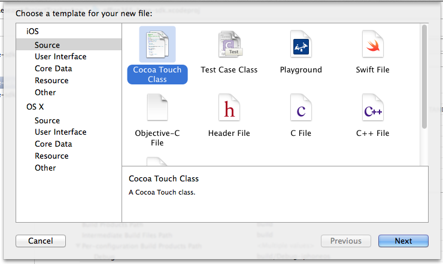
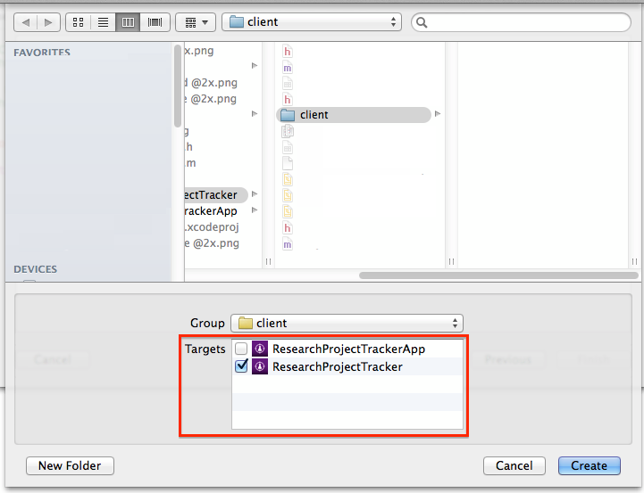

Module XX: *Manage Lists in a O365 tenant with iOS*
==========================

##Overview

The lab lets students use an AzureAD account to manage lists in a O365 Sharepoint tenant with an iOS app.

##Objectives

- Learn how to create a client for O365 to manage lists and listsItems
- Learn how to add features to create, edit and delete lists and items within an iOS app.

##Prerequisites

- Apple Macintosh environment
- XCode 6 (from the AppStore - compatible with iOS8 sdk)
- XCode developer tools (it will install git integration from XCode and the terminal)
- You must have a Windows Azure subscription to complete this lab.
- You must have completed Module 04 and linked your Azure subscription with your O365 tenant.

##Exercises

The hands-on lab includes the following exercises:

- [Add O365 iOS lists sdk library to the project](#exercise1)
- [Create a Client class for all operations](#exercise2)
- [Connect actions in the view to ProjectClient class](#exercise3)

<a name="exercise1"></a>
##Exercise 1: Add O365 iOS lists sdk library to a project
In this exercise you will use an existing application with the AzureAD authentication included, to add the O365 lists sdk library in the project
and create a client class with empty methods in it to handle the requests to the Sharepoint tenant.

###Task 1 - Open the Project
01. Download the starting point App:

    ```
    git clone 
    ```

02. Open the **.xcodeproj** file in the O365-lists-app

03. Find and Open the **ViewController.m** class under **O365-lists-app/controllers/login/**

04. Fill the AzureAD account settings in the **viewDidLoad** method
    
    

03. Build and Run the project in an iOS Simulator to check the views

    ```
    Application:
    You will se a login page with buttons to access the application and to clear credentials.
    Once authenticated, a Project list will appear with one fake entry. Also there is an add 
    Project screen (tapping the plus sign), and a Project Details screen (selecting a row in 
    the table) with References that contains a Title, Comments and a Url that can be opened
    in Safari app. Finally we can access to the screens to manage the References.

    Environment:
    To manage Projects and its References, we have two lists called "Research Projects" and 
    "Research References" in a Office365 Sharepoint tenant.
    Also we have permissions to add, edit and delete items from a list.
    We will use a files-sdk in order to access the environment using two classes called 
    "ListEntity" and "ListItem" that have all necesary data to manage the content.

    --We continue with the O365-lists-sdk library import to the project--
    ```

    

###Task 2 - Import the library
01. Download a copy of the library using the terminal:

    ```
    git clone 
    ```

02. Open the downloaded folder and copy **office365-lists-sdk** folder under **Sdk-ObjectiveC**. Paste it in a lib folder inside our project path.

    

03. Drag the **office365-lists-sdk.xcodeproj** file into XCode under our application project.
    
    

05. Go to project settings selecting the first file from the files explorer. Then click on **Build Phases** and add an entry in the **Target Dependencies** section.

    

06. Select the **office365-lists-sdk** library dependency.

    

07. Under **Link Binary with Libraries** add an entry pointing to **office365-lists-sdk.a** file

     

08. Follow 05-07 steps again, this time for the **Extension target**.

    

08. Build and Run the application to check everything is ok.

    

<a name="exercise2"></a>
##Exercise 2: Create a Client class for all operations
In this exercise you will create a client class for all the operations related to Projects and References. This class will connect to the **office365-lists-sdk**
and do some parsing and JSON handling

###Task 1 - Create a client class to connect to the o365-lists-sdk

01. On the XCode files explorer, under the group **ResearchProjectTrackerApp** you will se a **client** empty folder. Also under **ResearchProjectTrackerExtension/Supporting Files**
you have another **client** folder.

    

02. On the firt one, make a right click in the client folder and select **New File**. You will see the **New File wizard**. Click on the **iOS** section, select **Cocoa Touch Class** and click **Next**.

    

03. In this section, configure the new class giving it a name (**ProjectClient**), and make it a subclass of **ListClient**. Make sure that the language dropdown is set with **Objective-C** because our o365-lists library is written in that programming language. Finally click on **Next**.

        

04. Now we are going to select where the new class sources files (.h and .m) will be stored. In this case we can click on **Create** directly. This will create a **.h** and **.m** files for our new class.

    

05. Do the same for the other **client** folder under the **ResearchProjectTrackerExtension** in order to create the **ProjectClientEx** class, but in the last step of the wizard, change the target, to add visibility to this scope.

    

06. Now you will have a file structure like this:

    

07. Build the Project and you will see 2 errors. To fix them change the import sentences On **ProjectClient.h** and **ProjectClientEx.m**.

    From :
    ```
    #import "ListClient.h"
    ```

    To:
    ```
    #import <office365-lists-sdk/ListClient.h>
    ```

08. Re-build the project and check everything is ok.


###Task 2 - Add ProjectClient methods

01. Open the **ProjectClient.h** class and then add the following between **@interface** and **@end**

    ```
    - (NSURLSessionDataTask *)addProject:(ListItem *)listItem callback: (void (^)(BOOL success, NSError *error))callback;
    - (NSURLSessionDataTask *)updateProject:(ListItem *)project callback:(void (^)(BOOL, NSError *))callback;
    - (NSURLSessionDataTask *)updateReference:(ListItem *)reference callback:(void (^)(BOOL, NSError *))callback;
    - (NSURLSessionDataTask *)addReference:(ListItem *)reference callback: (void (^)(BOOL success, NSError *error))callback;
    - (NSURLSessionDataTask *)getReferencesByProjectId:(NSString *)projectId callback:(void (^)(NSMutableArray *listItems, NSError *error))callback;
    - (NSURLSessionDataTask *)deleteListItem:(NSString *)name itemId:(NSString *)itemId callback:(void (^)(BOOL result, NSError *error))callback;
    ```

    Each method is responsible of retrieve data from the O365 tenant and parse it, or manage add, edit, delete actions.

02. Add the body of each method in the **ProjectClient.h** file.

    Add Project
    ```
- (NSURLSessionDataTask *)addProject:(ListItem *)listItem callback:(void (^)(BOOL, NSError *))callback
{
    NSString *url = [NSString stringWithFormat:@"%@%@/GetByTitle('%@')/Items", self.Url , apiUrl, [@"Research Projects" urlencode]];
    
    NSString *json = [[NSString alloc] init];
    json = @"{ 'Title': '%@'}}";
    
    NSString *formatedJson = [NSString stringWithFormat:json, [listItem getTitle]];
    
    NSData *jsonData = [formatedJson dataUsingEncoding: NSUTF8StringEncoding];
    
    HttpConnection *connection = [[HttpConnection alloc] initWithCredentials:self.Credential
                                                                         url:url
                                                                   bodyArray: jsonData];
    
    NSString *method = (NSString*)[[Constants alloc] init].Method_Post;
    
    return [connection execute:method callback:^(NSData  *data, NSURLResponse *reponse, NSError *error) {
        ListItem *list;
        
        if(error == nil){
            list = [[ListItem alloc] initWithJson:data];
        }
        
        callback(list, error);
    }];
}
    ```

    Update Project
    ```
- (NSURLSessionDataTask *)updateProject:(ListItem *)project callback:(void (^)(BOOL, NSError *))callback
{
    NSString *url = [NSString stringWithFormat:@"%@%@/GetByTitle('%@')/Items(%@)", self.Url , apiUrl, [@"Research Projects" urlencode], project.Id];
    
    NSString *json = [[NSString alloc] init];
    json = @"{ 'Title': '%@'}";
    
    NSString *formatedJson = [NSString stringWithFormat:json, [project getTitle]];
    
    NSData *jsonData = [formatedJson dataUsingEncoding: NSUTF8StringEncoding];
    
    NSMutableURLRequest *theRequest=[NSMutableURLRequest requestWithURL:[NSURL URLWithString:url]];
    
    [theRequest setHTTPMethod:@"POST"];
    [theRequest setValue:@"application/json" forHTTPHeaderField:@"Content-Type"];
    [theRequest setValue:@"MERGE" forHTTPHeaderField:@"X-HTTP-Method"];
    [theRequest setValue:@"*" forHTTPHeaderField:@"IF-MATCH"];
    [theRequest setHTTPBody:jsonData];
    [self.Credential prepareRequest:theRequest];
    
    
    NSURLResponse * response = nil;
    NSError * error = nil;
    NSData * data = [NSURLConnection sendSynchronousRequest:theRequest
                                          returningResponse:&response
                                                      error:&error];
    
    NSDictionary *jsonResult = [NSJSONSerialization JSONObjectWithData:data
                                                               options: NSJSONReadingMutableContainers
                                                                 error:nil];
    NSString *myString = [[NSString alloc] initWithData:data encoding:NSUTF8StringEncoding];
    
    callback((!jsonResult && [myString isEqualToString:@""]), error);

    return 0;
}
    ```

    Update Reference
    ```
- (NSURLSessionDataTask *)updateReference:(ListItem *)reference callback:(void (^)(BOOL, NSError *))callback
{
    NSString *url = [NSString stringWithFormat:@"%@%@/GetByTitle('%@')/Items(%@)", self.Url , apiUrl, [@"Research References" urlencode], reference.Id];
    
    NSString *json = [[NSString alloc] init];
    json = @"{ 'Comments': '%@', 'URL':{'Url':'%@', 'Description':'%@'}}";
    
    NSDictionary *dic =[reference getData:@"URL"];
    NSString *refUrl = [dic valueForKey:@"Url"];
    NSString *refTitle = [dic valueForKey:@"Description"];
    
    NSString *formatedJson = [NSString stringWithFormat:json, [reference getData:@"Comments"], refUrl, refTitle];
    
    NSData *jsonData = [formatedJson dataUsingEncoding: NSUTF8StringEncoding];
    
    NSMutableURLRequest *theRequest=[NSMutableURLRequest requestWithURL:[NSURL URLWithString:url]];
    
    [theRequest setHTTPMethod:@"POST"];
    [theRequest setValue:@"application/json" forHTTPHeaderField:@"Content-Type"];
    [theRequest setValue:@"MERGE" forHTTPHeaderField:@"X-HTTP-Method"];
    [theRequest setValue:@"*" forHTTPHeaderField:@"IF-MATCH"];
    [theRequest setHTTPBody:jsonData];
    [self.Credential prepareRequest:theRequest];
    
    
    NSURLResponse * response = nil;
    NSError * error = nil;
    NSData * data = [NSURLConnection sendSynchronousRequest:theRequest
                                          returningResponse:&response
                                                      error:&error];
    
    NSDictionary *jsonResult = [NSJSONSerialization JSONObjectWithData:data
                                                               options: NSJSONReadingMutableContainers
                                                                 error:nil];
    NSString *myString = [[NSString alloc] initWithData:data encoding:NSUTF8StringEncoding];
    
    callback((!jsonResult && [myString isEqualToString:@""]), error);
    
    return 0;
}
    ```

    Add Reference
    ```
- (NSURLSessionDataTask *)addReference:(ListItem *)reference callback:(void (^)(BOOL, NSError *))callback
{
    NSString *url = [NSString stringWithFormat:@"%@%@/GetByTitle('%@')/Items", self.Url , apiUrl, [@"Research References" urlencode]];
    
    NSString *json = [[NSString alloc] init];
    json = @"{ 'URL': %@, 'Comments':'%@', 'Project':'%@'}";
    
    NSString *formatedJson = [NSString stringWithFormat:json, [reference getData:@"URL"], [reference getData:@"Comments"], [reference getData:@"Project"]];
    
    NSData *jsonData = [formatedJson dataUsingEncoding: NSUTF8StringEncoding];
    
    HttpConnection *connection = [[HttpConnection alloc] initWithCredentials:self.Credential
                                                                         url:url
                                                                   bodyArray: jsonData];
    
    NSString *method = (NSString*)[[Constants alloc] init].Method_Post;
    
    return [connection execute:method callback:^(NSData  *data, NSURLResponse *reponse, NSError *error) {
        ListEntity *list;
        
        if(error == nil){
            list = [[ListEntity alloc] initWithJson:data];
        }
        
        callback(list, error);
    }];
}
    ```

    Get References by Project
    ```
- (NSURLSessionDataTask *)getReferencesByProjectId:(NSString *)projectId callback:(void (^)(NSMutableArray *listItems, NSError *error))callback{
    NSString *queryString = [NSString stringWithFormat:@"Project eq '%@'", projectId];
    NSString *url = [NSString stringWithFormat:@"%@%@/GetByTitle('%@')/Items?$filter=%@", self.Url , apiUrl, [@"Research References" urlencode], [queryString urlencode]];
    HttpConnection *connection = [[HttpConnection alloc] initWithCredentials:self.Credential url:url];
    
    NSString *method = (NSString*)[[Constants alloc] init].Method_Get;
    
    return [connection execute:method callback:^(NSData *data, NSURLResponse *response, NSError *error) {
        NSDictionary *jsonResult = [NSJSONSerialization JSONObjectWithData:data
                                                                   options: NSJSONReadingMutableContainers
                                                                     error:nil];
        
        NSMutableArray *array = [NSMutableArray array];
        
        NSMutableArray *listsItemsArray =[self parseDataArray: data];
        for (NSDictionary* value in listsItemsArray) {
            [array addObject: [[ListItem alloc] initWithDictionary:value]];
        }
        
        callback(array ,error);
    }];
}
    ```

    Delete an Item
    ```
- (NSURLSessionDataTask *)deleteListItem:(NSString *)name itemId:(NSString *)itemId callback:(void (^)(BOOL result, NSError *error))callback{
    
    //NSString *queryString = [NSString stringWithFormat:@"filter=Id eq '%@'", itemId];
    NSString *url = [NSString stringWithFormat:@"%@%@/GetByTitle('%@')/Items(%@)", self.Url , apiUrl, [name urlencode], itemId];
    
    
    HttpConnection *connection = [[HttpConnection alloc] initWithCredentials:self.Credential
                                                                         url:url
                                                                   bodyArray: nil];
    
    NSString *method = (NSString*)[[Constants alloc] init].Method_Delete;
    
    return [connection execute:method callback:^(NSData  *data, NSURLResponse *reponse, NSError *error) {
        
        NSDictionary *jsonResult = [NSJSONSerialization JSONObjectWithData:data
                                                                   options: NSJSONReadingMutableContainers
                                                                     error:nil];
        
        BOOL result = FALSE;
        
        if(error == nil && [data length] == 0 ){
            result = TRUE;
        }
        
        callback(result, error);
    }];
}
    ```

03. Add the **JSON** handling methods:

    Parsing Results
    ```
    - (NSMutableArray *)parseDataArray:(NSData *)data{
    
    NSMutableArray *array = [NSMutableArray array];
    
    NSError *error ;
    
    NSDictionary *jsonResult = [NSJSONSerialization JSONObjectWithData:[self sanitizeJson:data]
                                                               options: NSJSONReadingMutableContainers
                                                                 error:&error];
    
    NSArray *jsonArray = [[jsonResult valueForKey : @"d"] valueForKey : @"results"];
    
    if(jsonArray != nil){
        for (NSDictionary *value in jsonArray) {
            [array addObject: value];
        }
    }else{
        NSDictionary *jsonItem =[jsonResult valueForKey : @"d"];
        
        if(jsonItem != nil){
            [array addObject:jsonItem];
        }
    }
    
    return array;
}
    ```

    Sanitizing JSON
    ```
 - (NSData*) sanitizeJson : (NSData*) data{
    NSString * dataString = [[NSString alloc ] initWithData:data encoding:NSUTF8StringEncoding];
    
    NSString* replacedDataString = [dataString stringByReplacingOccurrencesOfString:@"E+308" withString:@"E+127"];
    
    NSData* bytes = [replacedDataString dataUsingEncoding:NSUTF8StringEncoding];
    
    return bytes;
}
    ```


03. Build the project and check everything is ok.


<a name="exercise3"></a>
##Exercise 3: Connect actions in the view to ProjectClient class
In this exercise you will navigate in every controller class of the project, in order to connect each action (from buttons, lists and events) with one ProjectClient operation.

###Task1 - Wiring up ProjectTableView

01.

###Task2 - Wiring up CreateProjectView

01.

###Task3 - Wiring up ProjectDetailsView

01.

###Task4 - Wiring up EditProjectView

01.

###Task5 - Wiring up ReferencesTableView

01.

###Task6 - Wiring up CreateReferenceView

01.

###Task7 - Wiring up ReferenceDetailsView

01.

###Task8 - Wiring up EditReferenceView

01.


##Summary

By completing this hands-on lab you have learnt:

01. Some of the basics of iOS development.

02. How to add the ADALiOS library and bundles to the application 

03. How to call login and clear operations to handle the token from an AzureAD account for further requests

