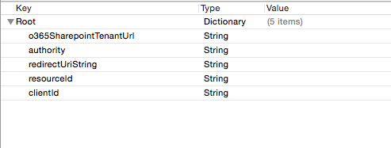
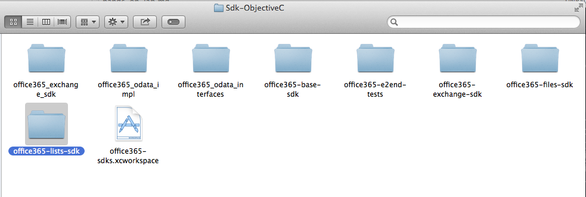

Module XX: *Manage Lists in a O365 tenant with iOS*
==========================

##Overview

The lab lets students use an AzureAD account to manage lists in a O365 Sharepoint tenant with an iOS app.

##Objectives

- Learn how to create a client for O365 to manage lists and listsItems
- Learn how to add features to create, edit and delete lists and items within an iOS app.

##Prerequisites

- Apple Macintosh environment
- XCode 6 (from the AppStore - compatible with iOS8 sdk)
- XCode developer tools (it will install git integration from XCode and the terminal)
- You must have a Windows Azure subscription to complete this lab.
- You must have completed Module 04 and linked your Azure subscription with your O365 tenant.

##Exercises

The hands-on lab includes the following exercises:

- [Add O365 iOS sdk's libraries to a project](#exercise1)
- [Create a Client class for all operations](#exercise2)
- [Connect actions in the view to ProjectClient class](#exercise3)

<a name="exercise1"></a>
##Exercise 1: Add O365 iOS sdk's libraries to a project
In this exercise you will use an existing application with the AzureAD authentication included, to add the O365 lists sdk library in the project
and create a client class with empty methods in it to handle the requests to the Sharepoint tenant.

###Task 1 - Open the Project
01. Download the starting point App:

    ```
    git clone 
    ```

02. Open the **.xcodeproj** file in the O365-lists-app

03. Find and Open the **ViewController.m** class under **O365-lists-app/controllers/login/**

04. Fill the AzureAD account settings in the **viewDidLoad** method
    
    

03. Build and Run the project in an iOS Simulator to check the views

    ```
    Application:
    You will se a login page with buttons to access the application and to clear credentials.
    Once authenticated, a Project list will appear with one fake entry. Also there is an add 
    Project screen (tapping the plus sign), and a Project Details screen (selecting a row in 
    the table) with References that contains a Title, Comments and a Url that can be opened
    in Safari app. Finally we can access to the screens to manage the References.

    Environment:
    To manage Projects and its References, we have two lists called "Research Projects" and 
    "Research References" in a Office365 Sharepoint tenant.
    Also we have permissions to add, edit and delete items from a list.
    We will use a files-sdk in order to access the environment using two classes called 
    "ListEntity" and "ListItem" that have all necesary data to manage the content.

    --We continue with the O365-lists-sdk library import to the project--
    ```


###Task 2 - Import the library
01. Download a copy of the library using the terminal:

    ```
    git clone 
    ```

02. Open the downloaded folder and copy the **office365-base-sdk** and **office365-lists-sdk** folders under **Sdk-ObjectiveC**. Paste them in a lib folder inside our project path.

    

03. Drag the **office365-base-sdk.xcodeproj** into XCode under our application project.

04. So the same with **office365-lists-sdk.xcodeproj**.

05. Go to project settings selecting the first file from the files explorer. Then click on **Build Phases** and add an entry in the **Target Dependencies** section.

06. Select the **office365-base-sdk** library dependency.

07. Under **Link Binary with Libraries** add an entry pointing to **office365-base-sdk.a** file

08. Build and Run the application to check is everithing is ok.


<a name="exercise2"></a>
##Exercise 2: Create a Client class for all operations
In this exercise you will create a client class for all the operations related to Projects and References. This class will connect to the **office365-lists-sdk**
and do some parsing and JSON handling

###Task 1 - Add the ProjectClient methods

01. Under **client** group, you will see the **ProjectClient.m** class. Open it and check the empty methods:

    ```
    - (NSURLSessionDataTask *)getReferencesByProjectId:(NSString *)projectId callback:(void (^)(NSMutableArray *listItems, NSError *error))callback;
    - (NSURLSessionDataTask *)addProject:(ListItem *)listItem callback: (void (^)(BOOL success, NSError *error))callback;
    - (NSURLSessionDataTask *)addReference:(ListItem *)reference callback: (void (^)(BOOL success, NSError *error))callback;
    - (NSURLSessionDataTask *)updateProject:(ListItem *)project callback:(void (^)(BOOL, NSError *))callback;
    - (NSURLSessionDataTask *)updateReference:(ListItem *)reference callback:(void (^)(BOOL, NSError *))callback;
    - (NSURLSessionDataTask *)deleteListItem:(NSString *)name itemId:(NSString *)itemId callback:(void (^)(BOOL result, NSError *error))callback;
    ```

02. Each method is responsible of retrieve data from the O365 tenant and parse it, or manage add, edit, delete actions.

    ```
    - (NSURLSessionDataTask *)getReferencesByProjectId:(NSString *)projectId callback:(void (^)(NSMutableArray *listItems, NSError *error))callback;
    - (NSURLSessionDataTask *)addProject:(ListItem *)listItem callback: (void (^)(BOOL success, NSError *error))callback;
    - (NSURLSessionDataTask *)addReference:(ListItem *)reference callback: (void (^)(BOOL success, NSError *error))callback;
    - (NSURLSessionDataTask *)updateProject:(ListItem *)project callback:(void (^)(BOOL, NSError *))callback;
    - (NSURLSessionDataTask *)updateReference:(ListItem *)reference callback:(void (^)(BOOL, NSError *))callback;
    - (NSURLSessionDataTask *)deleteListItem:(NSString *)name itemId:(NSString *)itemId callback:(void (^)(BOOL result, NSError *error))callback;
    ```

03. Build the project and check everything is ok.


<a name="exercise3"></a>
##Exercise 3: Connect actions in the view to ProjectClient class
In this exercise you will navigate in every controller class of the project, in order to connect each action (from buttons, lists and events) with one ProjectClient operation.

###Task1 - Wiring up ProjectTableView

01.

###Task2 - Wiring up CreateProjectView

01.

###Task3 - Wiring up ProjectDetailsView

01.

###Task4 - Wiring up EditProjectView

01.

###Task5 - Wiring up ReferencesTableView

01.

###Task6 - Wiring up CreateReferenceView

01.

###Task7 - Wiring up ReferenceDetailsView

01.

###Task8 - Wiring up EditReferenceView

01.


##Summary

By completing this hands-on lab you have learnt:

01. Some of the basics of iOS development.

02. How to add the ADALiOS library and bundles to the application 

03. How to call login and clear operations to handle the token from an AzureAD account for further requests

